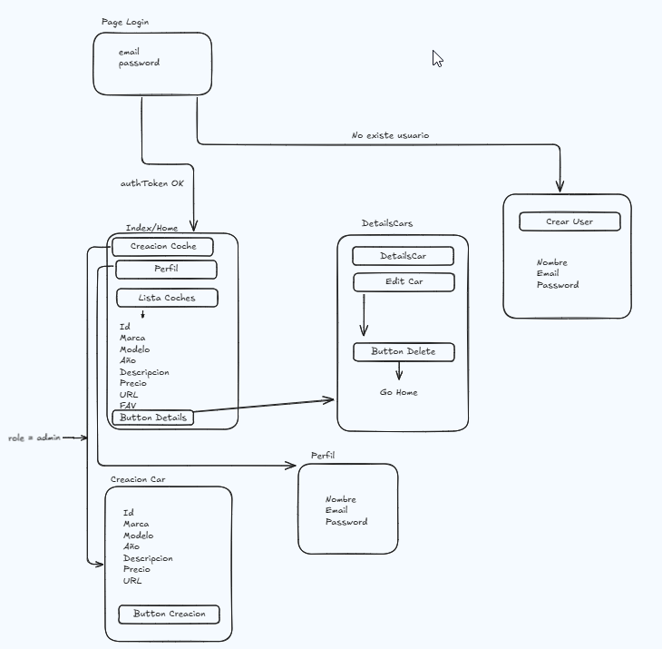

# ProyectoFinal
<h1>App gestor de usuarios y coches</h1>

<h2> Descripción </h2>

ProyectoFinal es una aplicación web para gestionar coches y usuarios, permitiendo a los administradores eliminar coches y a los usuarios gestionar sus perfiles.

Tecnologías utilizadas

    - Backend: Node.js, Express, MongoDB

    - Frontend: React, Next.js, CSS Modules

    - Base de datos: MongoDB con Mongoose

    - Control de versiones: Git y GitHub

Rutas principales

    - Backend: http://localhost:9000
    - Frontend: http://localhost:3000

Estructura del proyecto:

    - ProyectoFinal/
    │── back/             # Backend con Node.js y Express
        ├── models/           # Modelos de MongoDB
        ├── routes/           # Rutas de la API
        ├── controllers/      # Controladores de negocio
        ├── middleware/       # auth login
        ├── utils/            # Generate Token
        ├── mocks/            # Primera carga BD
        ├── index.js          # Punto de entrada del backend
 
    │── front/                # Frontend con Next.js
        ├── components/       # Componentes de React
        ├── pages/            # Páginas de la aplicación
        ├── styles/           # Estilos CSS Modules
        ├── api/              # Llamadas a la API
        ├── next.config.js    # Configuración de Next.js
 
    │── README.md             # Documentación del proyecto
    │── package.json          # Dependencias del proyecto
    │── .gitignore            # Archivos ignorados en Git

<h2>Instalación</h2>

1. Clonar el repositorio:

    - git clone https://github.com/VictorMGC2912/ProyectoFinal.git

2. Instalar dependencias
    
    - Backend:
        - cd back
        - npm install
    - Frontend:
        - cd front
        - npm install

3. Configurar variables de entorno

    Crea un archivo .env en la carpeta back con las siguientes variables:

        DATABASE_URL_DEV=tu_conexion_a_mongodb
        PORT=9000
        TOKEN_SECRET=tu_clave_secreta
        TOKEN_SECRET_REFRESH=tu_clave_secreta_refresco

4. Ejecutar el proyecto

    - Backend:
        - cd back
        - npm run start

    - Frontend:
        - cd front
        - npm run dev

5. Uso

    - Regístrate o inicia sesión.

    - Visualiza la lista de coches disponibles.

    - Los administradores pueden editar y eliminar coches.

    - Los usuarios pueden actualizar su perfil.
